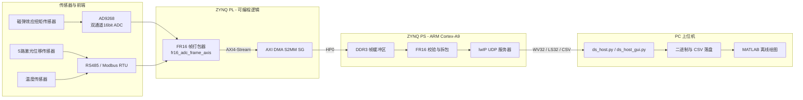

# 磁弹效应扭矩传感器数据采集系统

**Magnetoelastic Torque Sensor Data Acquisition System (ZYNQ-7020)**

基于 Xilinx ZYNQ-7020 的双通道数据采集系统，用于磁弹效应扭矩传感器信号、5 路激光位移和温度数据的同步采集。PL 将 ADC 波形、传感器时间线和统计信息组成 FR16 帧，经 AXI DMA 写入 PS DDR；PS 校验并拆解该帧，再通过 lwIP UDP 向 PC 发送波形、时间线和 summary；Python 上位机负责控制、完整性检查、落盘和实时预览。

---

## 功能特性 (Features)

- **高速双通道采集**：AD9268 双通道 16bit ADC，15.625 MSPS，9.0 Vpp 满量程
- **运行期可变帧长**：手动模式为 4,687,500 样点/通道（300 ms）；自动模式可配置 `16~4,687,500` 点
- **多传感器同步时间线**：5 路激光位移传感器 + 温度传感器（RS485 / Modbus RTU），与 ADC 波形同步记录
- **实时峰峰值统计**：采集过程中硬件实时计算 A/B 通道原始/滤波峰峰值
- **手动与自动采集**：支持 PC 命令触发长帧，以及基于 L2 阈值和轴转周期的自动短帧触发
- **UDP 高速回传**：PS 端使用 lwIP RAW API，把 DDR 中的 FR16 帧转换为 `WV32`、`LS32` 和 CSV summary
- **采集完整性记录**：GUI 自动连续记录会重组乱序分包、识别重复/缺失分包，并拒绝把不完整帧写入波形文件
- **PC 工具**：命令行 `ds_host.py`、Tkinter GUI `ds_host_gui.py` 和 MATLAB 离线绘图脚本
- **脚本化工程管理**：Block Design 通过 Tcl 脚本应用，支持工程复现与回归验证

---

## 系统架构 (System Architecture)



> **注意：FR16 和 UDP 不是同一种帧格式。** PL 到 DDR 的一帧始终是 `Header + Waveform + Timeline + Summary + Footer`。PS 不会把整段 FR16 原样发给 PC，而是读取并校验 DDR 后，重新封装成若干 `WV32` 波形包、手动模式下的 `LS32` 时间线包，以及一行 CSV summary；FR16 Header/Footer 不通过网口原样发送。

---

## 关键参数 (Key Parameters)

| 参数 | 值 | 说明 |
|---|---|---|
| SOC | Xilinx ZYNQ-7020 | PS + PL 异构 |
| ADC | AD9268 ×1 | 双通道 16bit，二进制补码输出 |
| 采样率 | 15.625 MSPS | 125 MHz 晶振 / 8 分频 |
| 满量程 | 9.0 Vpp | 电压换算 `int16_code * 9.0 / 65536` |
| 激光传感器 | PDL030-485 ×5 | 独立 RS485，当前工程 468800 bps、每路 700 us 轮询周期 |
| 温度传感器 | ×1 | 独立 RS485，9600 bps、200 ms 轮询周期 |
| 手动帧波形长度 | 4,687,500 样点/通道 | 300 ms / 帧；1000 rpm 时约覆盖 5 圈 |
| 自动帧波形长度 | 默认 3,125 样点/通道 | 默认 0.2 ms；允许 `16~4,687,500` 点 |
| 波形编码 | 4 B/样点 | 小端交织：`uint16 ADC_A` + `uint16 ADC_B`；按 ADC 二进制补码解释为 `int16` |
| DDR 手动帧大小 | 18,914,264 B | 含 18,750,000 B 波形和固定的 FR16 元数据区域 |
| 网络 | 千兆以太网 UDP | 板端 :5000 ↔ PC :50010 |
| 板端 IP | 192.168.1.10 | 静态配置 |
| PC 回传目标 | 192.168.1.100:50010 | 固定在当前 `echo.c` 中 |

---

## 目录结构 (Repository Structure)

```
DS_system/
├── DS_system/                          # Vivado 2018.3 工程
│   ├── DS_system.xpr                   # Vivado 工程文件
│   ├── DS_system.srcs/
│   │   ├── sources_1/imports/          # 自定义 RTL 源码
│   │   │   ├── src/                    #   ADC配置/传感器读取/基础模块
│   │   │   ├── fr16_m0_m1/             #   FR16 打包器（M0/M1 版）
│   │   │   ├── fr16_m2/                #   FR16 打包器（M2 真实ADC版）
│   │   │   ├── adc_pp_modified/        #   早期 ADC 采集核心
│   │   │   └── pl_reset_update/        #   采集逻辑/激光寄存器/桥接
│   │   ├── sources_1/bd/ps_system/     # Block Design（ps_system.bd）
│   │   ├── sources_1/bd/mref/          # 自定义 IP 定义
│   │   ├── constrs_1/                  # 引脚约束 XDC
│   │   └── sim_1/                      # SystemVerilog testbench
│   ├── DS_system.sdk/DS_System_PS/     # PS 端 C 应用（lwIP UDP）
│   ├── m0_m1_apply_bd.tcl              # M0/M1 Block Design 应用脚本
│   ├── m2_apply_bd.tcl                 # M2 Block Design 应用脚本
│   ├── m3_apply_bd.tcl                 # 当前 M3 Block Design 更新脚本
│   ├── M2_VALIDATION_REPORT.txt        # M2 重构静态验证报告
│   └── tools/                          # 静态检查/回归脚本
├── software/                           # PC 上位机
│   ├── ds_host.py                      # 命令行 UDP 接收/控制
│   ├── ds_host_gui.py                  # Tkinter GUI，含手动/自动模式
│   ├── plot_capture_frame.m            # MATLAB 波形绘图
│   ├── captures/                       # 默认实验输出目录
│   └── README.md                       # 上位机详细使用说明
└── .gitignore
```

---

## 关键模块 (Key Modules)

### PL 端 (Verilog)

| 模块 | 功能 |
|---|---|
| `fr16_adc_frame_axis.v` | FR16 打包器：运行期帧长锁存、ADC 跨时钟域、时间线、summary、footer |
| `pl_capture_logic.v` | 采集逻辑顶层（自定义 IP） |
| `axis_manual_bridge_v13.v` | M0/M1 版本使用的 AXIS 桥接模块 |
| `adc9268_config.v` | AD9268 SPI 初始化（9 次寄存器写入） |
| `modbus_rtu_master_uart.v` | Modbus RTU 主站（UART） |
| `rs485_sensors_reader.v` | 5 路激光和 1 路温度的独立 RS485 后台轮询 |
| `temperature_modbus_reader.v` | 温度传感器读取 |
| `pdl030_config_distance_reader.v` | 激光位移传感器（PDL030）配置与读取 |
| `laser_axi_regs.v` | 激光数据 AXI 寄存器接口 |
| `spi_write24.v` / `uart_rx_byte.v` / `uart_tx_byte.v` | 基础 SPI/UART 字节收发 |
| `sdp_bram.v` / `cdc_pulse_sync.v` / `clk_div_125m_to_1p25m.v` / `clk_gen_50m_to_125m.v` | BRAM / 跨时钟域 / 时钟生成 |

### PS 端 (C, ZYNQ SDK)

| 文件 | 功能 |
|---|---|
| `main.c` | lwIP 网络初始化、静态 IP 配置、主循环 |
| `echo.c` | DMA SG、FR16 校验、校准、自动触发、UDP 命令与数据回传 |
| `platform.c` / `platform_config.h` | 板级初始化与配置 |

### 上位机 (Python / MATLAB)

| 文件 | 功能 |
|---|---|
| `ds_host.py` | 命令行手动采集，逐帧保存波形、时间线、summary 和 metadata |
| `ds_host_gui.py` | Tkinter GUI：手动/自动控制、实时预览、连续记录和完整性检查 |
| `plot_capture_frame.m` | MATLAB 离线绘制整帧波形、峰峰值包络、激光时间线 |

---

## FR16 帧格式 (FR16 Frame Format)

FR16 是 PL 经 AXI4-Stream/AXI DMA 写入 DDR 的连续二进制格式，并不是 UDP 分包格式。设本帧每通道样点数为 `N`：

| 段 | DDR 字节偏移 | 长度 | 内容 |
|---|---:|---:|---|
| Header | `0` | 256 B | `FR16` magic、版本 3、frame_id、N、采样率、各段偏移和状态 |
| Waveform | `256` | `4 × N` B | 每点 `{ADC_B[15:0], ADC_A[15:0]}`，内存小端读取顺序为 A 后 B |
| Sensor timeline | `256 + 4N` | 163,840 B | 固定 4096 条容量，每条 40 B；只有前 `timeline_count` 条有效 |
| Summary | `164096 + 4N` | 128 B | A/B 峰峰值、帧状态、时间线数量和溢出计数 |
| Footer | `164224 + 4N` | 40 B | `DONE` magic、frame_id、实际帧长、N、TLAST 对应的结束信息 |

实际 DMA 传输长度为：

```text
frame_bytes = 256 + 4N + 4096×40 + 128 + 40
            = 164264 + 4N
```

手动模式 `N=4,687,500`，实际 FR16 帧长为 `18,914,264 B`。自动模式默认 `N=3,125`，实际帧长为 `176,764 B`。DDR 帧缓冲区起始地址为 `0x30000000`，按最大手动帧预留空间；当前 ring depth 为 1，超长帧由最多 8 个 DMA SG BD 承接。

运行期能够改变的是波形样点数 `N`。PS 通过 `laser_axi_regs` 的 `sample_count_cfg` 寄存器设置，PL 在接受采集触发时锁存；采集进行中不能修改。Header、Timeline、Summary、Footer 的结构和时间线容量不是运行期可变格式。`AUTO_STOP` 后 PS 会把 `N` 恢复为手动模式的 4,687,500。

---

## 手动与自动采集流程

### 手动模式

1. PC 向板端发送 `CAPTURE`（也接受 `CAP_START`）。
2. PS 为一帧 FR16 准备 DMA SG 描述符，再通过 AXI-Lite 写寄存器触发 PL。
3. PL 采集 `N=4,687,500` 点并输出完整 FR16 帧，DMA 经 HP0 写入 DDR。
4. PS 等待 DMA 完成，校验 FR16 Header、各段偏移、Footer、frame_id 和实际长度。
5. PS 依次发送全部 `WV32`、有效的 `LS32`，最后发送 CSV summary。
6. 上位机收齐后按帧保存波形、时间线、summary 和 metadata；UDP 不提供重传，缺包会写入 metadata。

### 自动模式

自动模式进入条件是零载校准状态为 `READY` 且 `cal_valid=1`。板端维护空闲计时 `t_idle_ms`：

```text
轴周期 period_ms = floor(60000 / rpm)
检测窗口 t_speed_ms = period_ms - 5 ms

当 t_idle_ms > t_speed_ms 且 L2_um < threshold_um 且采集状态为空闲时：
    触发一帧 points 点的短帧采集
    t_idle_ms 清零
```

三个参数的作用：

| 参数 | 范围/单位 | 对运行的影响 |
|---|---|---|
| 转速 `rpm` | `1~4000 rpm` | 决定轴周期和下一次阈值检测窗口的开放时间，不直接改变 ADC 采样率 |
| 阈值 `threshold_um` | 有符号 32 位，µm | 检测窗口打开后，L2 小于该值才允许触发 |
| 点数 `points` | `16~4,687,500` | 决定每次自动采集的波形时长和数据量，时长为 `points / 15,625,000 s` |

自动模式的 PL→DDR 数据仍是完整 FR16：`Header + Waveform + Timeline + Summary + Footer`。区别发生在 PS→PC：自动模式只发送 `WV32 + CSV summary`，不发送 `LS32` 时间线。因此 GUI 自动采集面板的 LS32 字段显示“自动模式不回传”。

---

## PS 到 PC 的 UDP 格式

### WV32 波形包

每包包含 40 B 头和最多 350 个双通道样点（最大 UDP payload 1440 B）：

| 偏移 | 类型 | 字段 |
|---:|---|---|
| 0 | 4 B | magic `WV32` |
| 4 | u8 | version = 1 |
| 5 | u8 | header length = 40 |
| 6 | u8 | flags = `0x03` |
| 7 | u8 | reserved |
| 8 | u32 LE | frame_id |
| 12 | u32 LE | chunk_index |
| 16 | u32 LE | total_chunks |
| 20 | u32 LE | start_sample |
| 24 | u32 LE | sample_count |
| 28 | u32 LE | total_samples |
| 32 | u32 LE | ADC A mVpp 提示值 |
| 36 | u32 LE | ADC B mVpp 提示值 |
| 40 | bytes | `sample_count × 4` 的 A/B 交织波形 |

### LS32 时间线包

仅手动模式发送。每包 40 B 头，后接最多 30 条记录；每条记录 40 B：

```text
timestamp_us, adc_sample_index, update_mask, sensor_status,
l1_um, l2_um, l3_um, l4_um, l5_um, temp_x10
```

### CSV summary

每帧最后发送一行 26 列 CSV，包含 frame_id、A/B 原始与滤波峰峰值、当前传感器值、status、校准结果、`ls_count` 和 `ls_overflow`。完整列定义见 [`software/README.md`](software/README.md)。

---

## GUI 自动连续记录

推荐在 `ds_host_gui.py` 中点击“启动并记录”：接收 socket 会先绑定 PC UDP 50010，再发送带当前三个参数的 `AUTO_START`，避免启动自动模式和建立记录线程之间丢失首帧。

按钮语义：

- **启动自动**：把输入框中的参数随 `AUTO_START` 下发；之后只改输入框不会影响板端。
- **应用参数**：发送 `AUTO_CFG`。转速和阈值可直接更新；改变点数时要求板端采集状态为空闲，否则返回 `#BUSY,capture_active`。
- **启动并记录**：先建立接收端，再使用当前输入框参数启动自动模式并记录。
- **仅开始记录**：只记录已经运行的自动模式，不下发参数。
- **停止记录**：停止 PC 接收和落盘，不会停止板端自动模式。
- **停止自动**：发送 `AUTO_STOP`；若一帧仍在采集，板端会先返回 busy，需要空闲后重试。

若板端尚未进入自动模式，直接设置参数后点击“启动并记录”。若已经点击过“启动自动”，之后又修改了输入框，必须先点击“应用参数”，再点击“仅开始记录”；仅修改输入框不会改变板端正在使用的参数。

每次点击“启动并记录”或“仅开始记录”都会建立独立的 `software/captures/auto_log_YYYYMMDD_HHMMSS/` 目录：

| 文件 | 内容 |
|---|---|
| `wave_interleaved_a_b_u16le.bin` | 本次记录所有完整帧共用的一个原始二进制文件，按帧完成顺序连续追加 |
| `summary.csv` | 收到的所有帧 summary |
| `integrity.csv` | 每帧的完整性、缺包、重复包、结束原因，以及在聚合波形文件中的字节偏移和长度 |

聚合波形文件没有额外插入帧头。每个样点为 4 B：小端 `uint16 ADC_A + uint16 ADC_B`。必须通过 `integrity.csv` 的 `wave_byte_offset`、`wave_bytes` 和 `wave_total_samples` 定位帧；不完整帧不会写入波形文件，对应位置字段留空。

---

## 状态与时间线说明

summary 的 `status` 是 32 位传感器状态位图，不是单一错误码：

| 位 | 含义 |
|---|---|
| `[5:0]` | 6 路传感器曾经产生过有效数据 `valid_seen` |
| `[11:6]` | CRC error |
| `[17:12]` | timeout error |
| `[23:18]` | frame error |
| `[25:24]` | ADC A/B over-range |
| `[31:26]` | 6 路 RS485 模块在帧开始时的 busy 快照 |

例如 `0x7c00003f` 与 `0x6c00003f` 的低 6 位都是 `0x3f`，表示 6 路传感器都曾有效；两者差异来自高位的 busy 快照，不表示 CRC/timeout/frame error 在变化。

`ls_count` 是 FR16 时间线记录数，不等于“完整激光轮询周期数”。每帧开始时 PL 会先写入 1 条初始快照，之后 6 路设备中任意一路产生 `valid_pulse` 都会增加一条记录。5 个激光通道独立并行轮询，因此即使自动波形只有 0.2 ms，也可能出现初始快照加若干个恰好落入窗口的更新，`ls_count=6` 并不等价于单个激光在 0.2 ms 内更新了 6 次。自动模式虽然 summary 仍带 `ls_count`，但 PS 不发送 LS32 内容。

---

## 快速开始 (Quick Start)

### 1. 上位机采集（详见 `software/README.md`）

```powershell
# 进入上位机目录
cd software

# 板端在线检测
python .\ds_host.py --board-ip 192.168.1.10 ping
python .\ds_host.py --board-ip 192.168.1.10 status

# 采集一帧
python .\ds_host.py --board-ip 192.168.1.10 capture

# 连续采集 10 次，间隔 1s
python .\ds_host.py --board-ip 192.168.1.10 capture -n 10 --interval 1

# 图形界面版（上板调试推荐）
python .\ds_host_gui.py

# 自动模式命令行示例：先完成零载校准
python .\ds_host.py --board-ip 192.168.1.10 cal-start
python .\ds_host.py --board-ip 192.168.1.10 cal-status

# 以 1000 rpm、L2 阈值 32000 um、每帧 3125 点启动自动模式
python .\ds_host.py --board-ip 192.168.1.10 auto-start --rpm 1000 --threshold 32000 --points 3125
python .\ds_host.py --board-ip 192.168.1.10 auto-status
python .\ds_host.py --board-ip 192.168.1.10 auto-recv -n 10
python .\ds_host.py --board-ip 192.168.1.10 auto-stop
```

> PC 网卡建议配置为 `192.168.1.100`，并确保没有其他程序占用 UDP 50010。当前板端固定向 `192.168.1.100:50010` 回传；命令发送源端口和数据接收端口均为 50010。

### 2. Vivado 工程复现

```tcl
# 在 Vivado 2018.3 Tcl Console 中打开 DS_system.xpr
# 应用 M0/M1 基线（AXIS 桥接路径）
source m0_m1_apply_bd.tcl
# 应用 M2 真实 ADC 打包器
source m2_apply_bd.tcl
# 在 M2 基础上连接运行期 sample_count_cfg，得到当前双模式设计
source m3_apply_bd.tcl
```

### 3. PS 应用编译（ZYNQ SDK）

- 导入 `DS_system.sdk/DS_System_PS` 工程
- BSP 基于硬件平台自动生成
- 编译后烧录，板端静态 IP `192.168.1.10`

---

## 版本里程碑 (Milestones)

| 版本 | 内容 |
|---|---|
| **M0/M1** | 基础采集路径建立：AD9268 采集 + AXI DMA + HP0 通路；`axis_manual_bridge_v13` 桥接修复 Block Design Validate 问题 |
| **M2** | FR16 打包器重构为真实 ADC 直通版本（`fr16_adc_frame_axis.v`），移除模式切换命令，通过静态验证 |
| **M3 / 当前版本** | 增加运行期帧长、零载校准、L2 阈值自动触发、自动短帧回传、GUI 连续记录与聚合二进制波形 |

> `M2_VALIDATION_REPORT.txt` 只记录 M2 阶段的源码静态验证。修改 RTL、Block Design 或 PS 应用后，发布前仍应重新生成 bitstream、导出硬件、重建 BSP/应用，并完成上板采集与长时间稳定性回归。

---

## 环境依赖 (Environment)

- **Vivado / SDK**：2018.3
- **Python**：3.x（标准库，无需第三方依赖）
- **MATLAB**：可选，用于离线绘图

---

## License

本项目代码仅供学习与科研参考。
