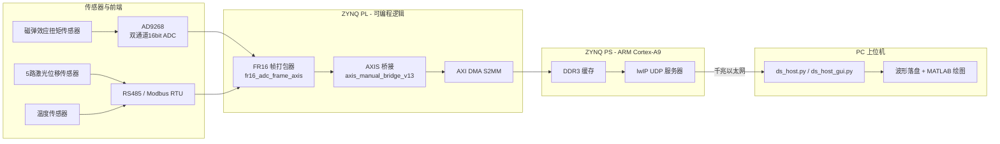

# 磁弹效应扭矩传感器数据采集系统

**Magnetoelastic Torque Sensor Data Acquisition System (ZYNQ-7020)**

基于 Xilinx ZYNQ-7020 的高精度双通道数据采集系统，用于磁弹效应扭矩传感器信号的采集、打包与以太网传输。PL 端完成 ADC 数据采集与帧打包，PS 端通过 lwIP UDP 协议将波形数据实时回传 PC，由 Python 上位机完成落盘与可视化。

---

## 功能特性 (Features)

- **高速双通道采集**：AD9268 双通道 16bit ADC，15.625 MSPS，9.0 Vpp 满量程
- **长帧连续打包**：单帧 4,687,500 样点/通道（300 ms），A/B 通道交织存储
- **多传感器同步时间线**：5 路激光位移传感器 + 温度传感器（RS485 / Modbus RTU），与 ADC 波形同步记录
- **实时峰峰值统计**：采集过程中硬件实时计算 A/B 通道原始/滤波峰峰值
- **UDP 高速回传**：PS 端 lwIP RAW 模式 UDP 服务器，一帧约 18.75 MB
- **双端上位机**：命令行 `ds_host.py` + Tkinter GUI `ds_host_gui.py` + MATLAB 离线绘图
- **脚本化工程管理**：Block Design 通过 Tcl 脚本应用，支持工程复现与回归验证

---

## 系统架构 (System Architecture)



**数据流**：AD9268 差分输入采集扭矩传感器信号 → PL 端 FR16 帧打包器按固定帧格式组织数据（波形 + 传感器时间线 + summary）→ AXI DMA 经 HP0 口写入 PS DDR → lwIP UDP 服务器通过千兆网发送至 PC → 上位机按帧落盘。

---

## 关键参数 (Key Parameters)

| 参数 | 值 | 说明 |
|---|---|---|
| 平台 | Xilinx ZYNQ-7020 | PS + PL 异构 |
| ADC | AD9268 ×1 | 双通道 16bit，二进制补码输出 |
| 采样率 | 15.625 MSPS | 125 MHz 晶振 / 8 分频 |
| 满量程 | 9.0 Vpp | 电压换算 `int16_code * 9.0 / 65536` |
| 帧长度 | 4,687,500 样点/通道 | 300 ms / 帧 |
| 帧大小 | ~18.75 MB | A/B 交织，每样点 4 字节 |
| 网络 | 千兆以太网 UDP | 板端 :5000 ↔ PC :50010 |
| 板端 IP | 192.168.1.10 | 静态配置 |

---

## 目录结构 (Repository Structure)

```
DS_system/
├── DS_system/                          # Vivado 2018.3 工程
│   ├── DS_system.xpr                   # Vivado 工程文件
│   ├── DS_system.srcs/
│   │   ├── sources_1/imports/          # 自定义 RTL 源码
│   │   │   ├── src/                    #   ADC配置/传感器读取/基础模块
│   │   │   ├── fr16_m0_m1/             #   FR16 打包器（M0/M1 版）
│   │   │   ├── fr16_m2/                #   FR16 打包器（M2 真实ADC版）
│   │   │   ├── adc_pp_modified/        #   早期 ADC 采集核心
│   │   │   └── pl_reset_update/        #   采集逻辑/激光寄存器/桥接
│   │   ├── sources_1/bd/ps_system/     # Block Design（ps_system.bd）
│   │   ├── sources_1/bd/mref/          # 自定义 IP 定义
│   │   ├── constrs_1/                  # 引脚约束 XDC
│   │   └── sim_1/                      # SystemVerilog testbench
│   ├── DS_system.sdk/DS_System_PS/     # PS 端 C 应用（lwIP UDP）
│   ├── m0_m1_apply_bd.tcl              # M0/M1 Block Design 应用脚本
│   ├── m2_apply_bd.tcl                 # M2 Block Design 应用脚本
│   ├── M2_VALIDATION_REPORT.txt        # M2 重构静态验证报告
│   └── tools/                          # 静态检查/回归脚本
├── software/                           # PC 上位机
│   ├── ds_host.py                      # 命令行 UDP 接收/控制
│   ├── ds_host_gui.py                  # Tkinter 图形界面版
│   ├── plot_capture_frame.m            # MATLAB 波形绘图
│   └── README.md                       # 上位机详细使用说明
└── .gitignore
```

---

## 关键模块 (Key Modules)

### PL 端 (Verilog)
| 模块 | 功能 |
|---|---|
| `fr16_adc_frame_axis.v` | FR16 长帧打包器：256B 头 + 波形 + 传感器时间线 + summary + footer |
| `pl_capture_logic.v` | 采集逻辑顶层（自定义 IP） |
| `axis_manual_bridge_v13.v` | AXIS 桥接，保持 BD Validate 通过 |
| `adc9268_config.v` | AD9268 SPI 初始化（9 次寄存器写入） |
| `modbus_rtu_master_uart.v` | Modbus RTU 主站（UART） |
| `rs485_sensors_reader.v` | RS485 多传感器轮询读取 |
| `temperature_modbus_reader.v` | 温度传感器读取 |
| `pdl030_config_distance_reader.v` | 激光位移传感器（PDL030）配置与读取 |
| `laser_axi_regs.v` | 激光数据 AXI 寄存器接口 |
| `spi_write24.v` / `uart_rx_byte.v` / `uart_tx_byte.v` | 基础 SPI/UART 字节收发 |
| `sdp_bram.v` / `cdc_pulse_sync.v` / `clk_div_125m_to_1p25m.v` / `clk_gen_50m_to_125m.v` | BRAM / 跨时钟域 / 时钟生成 |

### PS 端 (C, ZYNQ SDK)
| 文件 | 功能 |
|---|---|
| `main.c` | lwIP 网络初始化、静态 IP 配置、主循环 |
| `echo.c` | UDP 命令处理与波形/时间线回传逻辑 |
| `platform.c` / `platform_config.h` | 板级初始化与配置 |

### 上位机 (Python / MATLAB)
| 文件 | 功能 |
|---|---|
| `ds_host.py` | 命令行 UDP 接收/控制，支持连续采集、通道拆分 |
| `ds_host_gui.py` | Tkinter GUI：连接控制、采集进度、波形预览、校准信息 |
| `plot_capture_frame.m` | MATLAB 离线绘制整帧波形、峰峰值包络、激光时间线 |

---

## FR16 帧格式 (FR16 Frame Format)

每帧由若干 8192 字节 chunk 组成，chunk 内部布局：

| 段 | 偏移 | 长度 | 内容 |
|---|---|---|---|
| Header | 0 | 256 B | 帧标识、magic、偏移校验 |
| Waveform | 256 | 6248 B | 1562 样点对 `{ADC_B[15:0], ADC_A[15:0]}`（小端） |
| Summary | 6504 | 128 B | 峰峰值、校准状态、传感器计数 |
| Footer | 8152 | 40 B | 完成标记、TLAST |

单帧共 4,687,500 样点/通道（3000 个 chunk），波形数据在采样过程中实时计算峰峰值，最后写入 summary。

---

## 快速开始 (Quick Start)

### 1. 上位机采集（详见 `software/README.md`）

```powershell
# 进入上位机目录
cd software

# 板端在线检测
python .\ds_host.py --board-ip 192.168.1.10 ping
python .\ds_host.py --board-ip 192.168.1.10 status

# 采集一帧
python .\ds_host.py --board-ip 192.168.1.10 capture

# 连续采集 10 次，间隔 1s
python .\ds_host.py --board-ip 192.168.1.10 capture -n 10 --interval 1

# 图形界面版（上板调试推荐）
python .\ds_host_gui.py
```

> PC 网卡建议配置为 `192.168.1.100`，板端固定回发目标为 `192.168.1.100:50010`。

### 2. Vivado 工程复现

```tcl
# 在 Vivado 2018.3 Tcl Console 中打开 DS_system.xpr
# 应用 M0/M1 基线（AXIS 桥接路径）
source m0_m1_apply_bd.tcl
# 应用 M2 真实 ADC 打包器
source m2_apply_bd.tcl
```

### 3. PS 应用编译（ZYNQ SDK）
- 导入 `DS_system.sdk/DS_System_PS` 工程
- BSP 基于硬件平台自动生成
- 编译后烧录，板端静态 IP `192.168.1.10`

---

## 版本里程碑 (Milestones)

| 版本 | 内容 |
|---|---|
| **M0/M1** | 基础采集路径建立：AD9268 采集 + AXI DMA + HP0 通路；`axis_manual_bridge_v13` 桥接修复 Block Design Validate 问题 |
| **M2** | FR16 打包器重构为真实 ADC 直通版本（`fr16_adc_frame_axis.v`），移除模式切换命令，通过静态验证 |

> 注：M2 已通过源码级静态验证（见 `M2_VALIDATION_REPORT.txt`），板级硬件验收（综合/时序/上板/soak test）待完成。

---

## 环境依赖 (Environment)

- **Vivado / SDK**：2018.3
- **Python**：3.x（标准库，无需第三方依赖）
- **MATLAB**：可选，用于离线绘图

---

## License

本项目代码仅供学习与科研参考。
