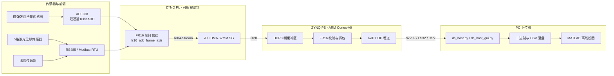

# 磁弹效应扭矩传感器数据采集系统

**Magnetoelastic Torque Sensor Data Acquisition System (ZYNQ-7020)**

基于 Xilinx ZYNQ-7020 的数据采集系统，用于磁弹效应扭矩传感器的载波信号、5 路激光位移和 1 路温度数据的同步采集。PL 将 ADC 波形（wave）、传感器时间线（sensor timeline）和摘要信息（summary）组成 FR16 帧，经 AXI DMA 写入 PS DDR；PS 校验并拆解该帧，再通过 lwIP UDP 向 PC 发送 wave、sensor timeline 和 summary；Python 上位机负责控制、完整性检查、落盘和实时预览。

---

## 功能特性 (Features)

- **高速双通道采集**：AD9268 双通道 16bit ADC，125MSPS/8 = 15.625 MSPS，9.0 Vpp 满量程
- **运行期可变帧长**：采集点数 N 可由上位机指定，范围为 `16~4687500` 点
- **多传感器同步波形时间线**：5 路激光位移传感器 + 温度传感器（RS485 / Modbus RTU），与 ADC 波形同步记录
- **实时峰峰值统计**：采集过程中硬件实时计算 A/B 通道原始/滤波峰峰值
- **手动触发与L2 阈值触发采集**：支持 PC 命令手动触发采集，以及基于 L2 阈值(气隙阈值)和轴转周期的自动触发采集
- **UDP 高速回传**：PS 端把 DDR 中的 FR16 帧转换为 `WV32`、`LS32` 和 `CSV summary`，通过 lwIP RAW API向上位机发送。
- **采集完整性记录**：GUI L2触发连续记录会重组乱序分包、识别重复/缺失分包，并拒绝把不完整帧写入波形文件
- **PC 工具**：命令行 `ds_host.py`、Tkinter GUI `ds_host_gui.py` 和 MATLAB 离线绘图脚本
- **脚本化工程管理**：Block Design 支持通过 Tcl 脚本应用
- **FR16 帧格式**：Header(256Byte) + Waveform(4*NByte) + Timeline(4096*40Byte) + Summary(128Byte) + Footer(40Byte) = 164264 + 4N Byte
---

## 系统架构 (System Architecture)



> **注意：FR16 和 UDP 不是同一种帧格式。** PL 到 DDR 的FR616帧始终是 `Header + Waveform + Timeline + Summary + Footer`。PS 不会把整段 FR16 原样发给 PC，而是读取并校验 FR16 后，重新封装成若干 `WV32` 波形包、手动触发模式下的 `LS32` 时间线包，以及一行 CSV summary。先发送所有的 `WV32` 波形包，然后发送 `LS32` 时间线包，最后发送一行 CSV summary，FR16 Header/Footer 不通过网口原样发送。

---

## 关键参数 (Key Parameters)

| 参数 | 值 | 说明 |
|---|---|---|
| SOC | Xilinx ZYNQ-7020 | PS + PL 异构 |
| ADC | AD9268 ×1 | 双通道 16bit，二进制补码输出 |
| 采样率 | 15.625 MSPS | 实际采用 125 MHz / 8 |
| 满量程 | 9.0 Vpp | 电压换算 `int16_code * 9.0 / 65536` |
| 激光传感器 | PDL030-485 ×5 | 独立 RS485，当前工程 468800 bps、每路 700 us 轮询周期 |
| 温度传感器 | SA10R4DF×1 |红外测温 独立 RS485，9600 bps、200 ms 轮询周期 |
| 手动触发帧波形长度 | 4,687,500 样点/通道 |默认值；50khz激励信号下就是 300 ms / 帧；1000 rpm 时约覆盖 5 圈 |
| L2触发帧波形长度 | 3,125 样点/通道 | 默认值；50khz激励信号下就是 0.2 ms / 帧 |
| 波形编码 | 4 B/样点 | 小端交织：`uint16 ADC_A` + `uint16 ADC_B`；按 ADC 二进制补码解释为 `int16` |
| 网络 | 千兆以太网 UDP协议 | MTU: 1500 B |
| 板端 IP | 192.168.1.10:5000 | 静态配置 |
| PC IP | 192.168.1.100:50010 | 固定在当前 `echo.c` 中 |

---

## 仓库结构 (Repository Structure)

```
DS_system/
├── DS_system/                          # Vivado 2018.3 工程
│   ├── DS_system.xpr                   # Vivado 工程文件
│   ├── DS_system.srcs/
│   │   ├── sources_1/imports/          # 自定义 RTL 源码
│   │   │   ├── src/                    # ADC配置/485读取/时钟配置
│   │   │   ├── fr16_m2/                # FR16 打包器
│   │   │   └── pl_reset_update/        # 顶层采集控制逻辑/AXI-lite寄存器/桥接  
│   │   ├── sources_1/bd/ps_system/     # Block Design（ps_system.bd）
│   │   ├── sources_1/bd/mref/          # 自定义 IP 定义
│   │   └──  constrs_1/                 # 引脚约束 XDC
│   ├── DS_system.sdk/DS_System_PS/     # PS 端 C 应用（lwIP UDP）
│   ├── m0_m1_apply_bd.tcl              # 旧工程恢复脚本：重建 AXIS 桥接到 DMA 的基线路径
│   ├── m2_apply_bd.tcl                 # 旧工程迁移脚本：刷新真实 ADC 打包器并固定 DMA SG 配置
│   ├── m3_apply_bd.tcl                 # 旧工程迁移/修复脚本：连接运行期 sample_count_cfg
│   └── tools/                          # 静态检查/回归脚本(重建BSP后恢复 lwIP xadapter.c 的非阻塞链路补丁)
├── software/                           # PC 上位机
│   ├── ds_host.py                      # 命令行 UDP 接收/控制
│   ├── ds_host_gui.py                  # Tkinter 上位机GUI界面
│   ├── ds_monitor.py                   # L2触发模式下单线程接收，管理连续记录、扭矩模型训练会话
│   ├── ds_torque.py                    # 对实时扭矩执行滑动平均，扭矩模型训练时计算零点均值、漂移、稳定性等指标
│   ├── plot_capture_frame.m            # MATLAB 波形绘图
│   ├── captures/                       # 默认实验输出目录
│   ├── test_ds_workflow.py             # 测试数据流脚本
│   └── README.md                       # 上位机详细使用说明
└── .gitignore
```

---

## 关键模块 (Key Modules)

### PL 端 (Verilog)

| 模块 | 功能 |
|---|---|
| `fr16_adc_frame_axis.v` | FR16 打包器：运行期帧长锁存、ADC 跨时钟域FIFO、Header、Wave、Timeline、Summary、Footer |
| `pl_capture_logic.v` | 采集逻辑顶层 |
| `axis_manual_bridge_v13.v` | AXIS 桥接模块 |
| `adc9268_config.v` | AD9268 SPI 初始化：有符号数输出，8分频|
| `modbus_rtu_master_uart.v` | Modbus RTU 主站（UART） |
| `rs485_sensors_reader.v` | 5 路激光和 1 路温度的独立 RS485 后台轮询，激光0.7ms轮询周期，温度200ms轮询周期 |
| `temperature_modbus_reader.v` | 温度传感器读取 |
| `pdl030_config_distance_reader.v` | 激光位移传感器（PDL030）配置与读取 |
| `laser_axi_regs.v` | 激光数据 AXI 寄存器接口 |
| `spi_write24.v` / `uart_rx_byte.v` / `uart_tx_byte.v` | 基础 SPI/UART 字节收发 |
| `sdp_bram.v` / `cdc_pulse_sync.v` / `clk_div_125m_to_1p25m.v` / `clk_gen_50m_to_125m.v` | BRAM / 跨时钟域 / 时钟生成 |

### PS 端 (C, ZYNQ SDK)

| 文件 | 功能 |
|---|---|
| `main.c` | lwIP 网络初始化、静态 IP 配置、主循环 |
| `echo.c` | 所有应用程序 |
| `platform.c` / `platform_config.h` | 板级初始化与配置 |

### 上位机 (Python / MATLAB)

| 文件 | 功能 |
|---|---|
| `ds_host.py` | 命令行手动采集，逐帧保存波形、时间线、summary 和 metadata |
| `ds_host_gui.py` | Tkinter GUI：手动/L2触发控制、实时预览、连续记录和完整性检查 |
| `ds_host.py`| 命令行版本
|`ds_monitor.py`| L2触发模式下的单接收线程、连续记录、模型训练会话管理
|`ds_torque.py`| 扭矩模型、滑动平均、质量检查、模型标定和失效判断
|`test_ds_workflow.py`| 测试数据流脚本，测试文件使用合成 UDP 数据，不需要真实板卡
| `plot_capture_frame.m` | MATLAB 离线绘制整帧波形、峰峰值包络、激光时间线 |

---

## FR16 帧格式 (FR16 Frame Format)

FR16 是 PL 经 AXI4-Stream/AXI DMA 写入 DDR 的连续二进制格式，并不是 UDP 分包格式。设本帧每通道样点数为 `N`：

| 段 | DDR 字节偏移 | 长度 | 内容 |
|---|---:|---:|---|
| Header | `0` | 256 B | `FR16` magic、版本 3、frame_id、N、采样率、各段偏移和状态 |
| Waveform | `256` | `4 × N` B | 每点 `{ADC_B[15:0], ADC_A[15:0]}`，内存小端读取顺序为 A 后 B |
| Sensor timeline | `256 + 4N` | 163,840 B | 固定 4096 条容量，每条 40 B；只有前 `timeline_count` 条有效 |
| Summary | `164096 + 4N` | 128 B | A/B 峰峰值、帧状态、时间线数量和溢出计数 |
| Footer | `164224 + 4N` | 40 B | `DONE` magic、frame_id、实际帧长、N、TLAST 对应的结束信息 |

所以实际 DMA 传输长度为：

```text
frame_bytes = 256 + 4N + 4096×40 + 128 + 40
            = 164264 + 4N
```

手动触发模式默认 `N=4,687,500`，实际 FR16 帧长默认为 `18,914,264 B`。自动触发模式默认 `N=3,125`，实际帧长为 `176,764 B`。DDR 帧缓冲区起始地址为 `0x30000000`，已按最大手动帧预留空间；当前 ring depth 为 1，超长帧由最多 8 个 DMA SG BD 承接。

运行期能够改变的是波形样点数 `N`。PS 通过 `laser_axi_regs` 的 `sample_count_cfg` 寄存器设置，PL 在接受采集触发时锁存；采集进行中不能修改。Header、Timeline、Summary、Footer 的结构和时间线容量不是运行期可变格式。`AUTO_STOP` 后 PS 会把 `N` 恢复为手动模式的 4,687,500。

---

## 手动与自动采集流程

### 手动模式

1. PC 向板端发送字符串 `"CAPTURE"`（也接受 `"CAP_START"`）。
2. PS 为一帧 FR16 准备 DMA SG 描述符，再通过 AXI-Lite 写寄存器触发 PL。
3. PL 采集 `N=4,687,500` 点并输出完整 FR16 帧，DMA 经 HP0 写入 DDR。
4. PS 等待 DMA 完成，校验 FR16 Header、各段偏移、Footer、frame_id 和实际长度。
5. PS 依次发送全部 `WV32`、有效的 `LS32`，最后发送 CSV summary。
6. 上位机收齐后按帧保存波形、时间线、summary 和 metadata；UDP 不提供重传，缺包会写入 metadata。

### 自动模式

前置条件：自动模式进入条件是零载校准状态为 `READY` 。：

三个参数的作用：
| 参数 | 范围/单位 | 对运行的影响 |
|---|---|---|
| 转速 `rpm` | `1~4000 rpm` | 决定检测窗口的开放时机 |
| 阈值 `threshold_um` | 有符号 32 位，µm | 检测窗口打开后，L2 小于该值才允许触发 |
| 点数 `points` | `16~4,687,500` | 决定每次自动采集波形点数` |
```text
轴转动周期 period_ms = floor(60000 / rpm)
开启检测窗口时机 t_speed_ms = period_ms - 5 ms，即提前轴周期5秒开放检测周期，检测L2(气隙)是否满足要求

当 t_idle_ms > t_speed_ms 且 L2_um < threshold_um 且采集状态为空闲时：        //t_idle_ms 为自上一次触发采集时间后的时间
    触发一帧 points 点的短帧采集
    t_idle_ms 清零  
```

自动模式的 PL→DDR 数据仍是完整 FR16：`Header + Waveform + Timeline + Summary + Footer`。区别发生在 PS→PC：自动模式只发送 `WV32 + CSV summary`，不发送 `LS32` 时间线。

---

## PS 到 PC 的 UDP 格式

### WV32 波形包

每包包含 40 B 头和最多 350 个双通道样点（最大 UDP payload 1440 B）：

| 偏移 | 类型 | 字段 |
|---:|---|---|
| 0 | 4 B | magic `WV32` |
| 4 | u8 | version = 1 |
| 5 | u8 | header length = 40 |
| 6 | u8 | flags = `0x03` |
| 7 | u8 | reserved |
| 8 | u32 LE | frame_id |
| 12 | u32 LE | chunk_index |
| 16 | u32 LE | total_chunks |
| 20 | u32 LE | start_sample |
| 24 | u32 LE | sample_count |
| 28 | u32 LE | total_samples |
| 32 | u32 LE | ADC A mVpp 提示值 |
| 36 | u32 LE | ADC B mVpp 提示值 |
| 40 | bytes | `sample_count × 4` 的 A/B 交织波形 |

### LS32 时间线包

仅手动模式发送。每包包含 40 B 头和最多 30 条时间线记录（最大 UDP payload 1240 B），每条记录 40 B：

| 偏移 | 类型 | 字段 |
|---:|---|---|
| 0 | 4 B | magic `LS32` |
| 4 | u8 | version = 1 |
| 5 | u8 | header length = 40 |
| 6 | u8 | record length = 40 |
| 7 | u8 | reserved = 0 |
| 8 | u32 LE | frame_id |
| 12 | u32 LE | chunk_index |
| 16 | u32 LE | total_chunks |
| 20 | u32 LE | start_record |
| 24 | u32 LE | record_count |
| 28 | u32 LE | total_records |
| 32 | u32 LE | total_samples，本帧每通道的波形样点数 |
| 36 | u32 LE | reserved = 0 |
| 40 | bytes | `record_count × 40` 的时间线记录 |

单条时间线记录的布局如下：

| 记录内偏移 | 类型 | 字段 |
|---:|---|---|
| 0 | u32 LE | timestamp_us，本帧开始后的时间戳，单位 µs |
| 4 | u32 LE | adc_sample_index，对应的 ADC 样点索引 |
| 8 | u32 LE | update_mask，低 6 位依次表示 L1、L2、L3、L4、L5、温度是否在本条记录中更新 |
| 12 | u32 LE | sensor_status，传感器状态位图 |
| 16 | i32 LE | l1_um，L1 位移，单位 µm |
| 20 | i32 LE | l2_um，L2 位移，单位 µm |
| 24 | i32 LE | l3_um，L3 位移，单位 µm |
| 28 | i32 LE | l4_um，L4 位移，单位 µm |
| 32 | i32 LE | l5_um，L5 位移，单位 µm |
| 36 | i32 LE | temp_x10，温度值的 10 倍 |

### CSV summary

每帧最后发送一行 26 列 CSV，包含 frame_id、A/B 原始与滤波峰峰值、当前传感器值、传感器status、校准结果、`ls_count` 和 `ls_overflow`。完整列定义见 [`software/README.md`](software/README.md)。

GUI 落盘时会在每个 summary 行末附加 `pc_timestamp`，记录 PC 接收该帧 summary 的时间（含时区/微秒）。

## GUI 校准、模型标定与 L2 监测

操作顺序为：**静态卸载并稳定信号 → 通道校准 → 加载到参考扭矩 T0 并稳定转速 → 扭矩模型标定 → L2 监测 → 实验记录**。通道校准负责配平 A/B 两路测量链；模型标定负责建立当前通道增益和触发配置下的扭矩参考点。详见 [上位机操作说明](software/README.md)。

### 1. 通道校准

静态卸载、激励和信号稳定后，点击 GUI 的 **① 开始通道校准**。GUI 先发送 `CAL_START_SHORT`，确认板端支持 `cal_protocol=2,points=3125`，再逐帧发送 `CAPTURE` 并在每帧结束后查询 `CAL_STATUS`。每个短帧包含 3125 点/通道，在 15.625 MSPS 下对应 0.2 ms，即 50 kHz 激励的 10 个周期。

板端状态按 `IDLE → DISCARD → COLLECT → COMPUTE → VERIFY → READY/FAILED` 流转。一次正常尝试丢弃 8 帧、收集 96 帧、验证 96 帧，共 200 个有效帧，最多尝试 3 次。收集阶段使用 A/B 两通道的滤波峰峰值均值计算乘法增益，使两路在零载状态下对齐；验证阶段要求校正差值同时满足：均值绝对值不超过 100 µV、样本标准差不超过 2000 µV、前后半段漂移绝对值不超过 500 µV。

校准通过后板端置 `cal_state=READY`、`cal_valid=1`，并在 summary 中输出通道增益、校正后的 A/B 峰峰值、`me_2x_uV` 和 `me_norm_ppm`。增益只用于 summary 的派生计算，不修改 FR16/WV32 中的原始 ADC 波形。L2 自动模式必须在通道校准有效后才能启动；重新校准、清除校准或板端增益变化都会使已有扭矩模型失效。

### 2. 扭矩模型标定

通道校准通过后，将设备运行到恒定参考扭矩和稳定转速，再设置 L2 转速、阈值、每帧采集点数、参考扭矩 `T0`、标定时间和平均帧数 `N`。默认值为 `T0=100 N·m`、标定时间 60 s、`N=15`。`T0` 来自加载设备的设定值，并非独立标准扭矩仪的实测值。

点击 **② 扭矩模型标定 → 开始标定** 后，如果 L2 监测尚未启动，GUI 会先启动自动触发；如果已经在监测，则直接进入标定。标定从第一个有效完整帧开始计时，只接纳通道校准有效、增益保持一致、采集点数匹配、ADC 未过量程且 `me_2x_uV` 有效的完整帧。首个有效帧等待超过 20 s，或标定期间有效数据中断超过 5 s，都会终止本次标定。

`V0` 直接取标定区间内所有有效完整帧原始 `me_2x_uV` 的均值，不对重叠滑动平均结果再次求平均：

```text
V0 [µV] = mean(标定区间内有效完整帧的 me_2x_uV)
T [N·m] = 0.4424 × (mean_N(me_2x_uV) − V0) + T0
```

其中 `0.4424 N·m/µV` 是当前固定斜率，模型标定只确定参考点 `V0/T0`，不会重新拟合斜率。只有当 `T0=0` 时，`V0` 才表示零扭矩参考值。标定至少需要 `max(2,N)` 个有效帧，且有效样本覆盖时间不得少于设置标定时间的 80%。

程序还会用 N 帧滑动平均结果检查标定区间的稳定性：滤波后扭矩峰峰值不超过 200 N·m，平均窗口的时间跨度不超过 5 s。该结果仅作为区间稳定性提示，不是模型生成的硬性门槛，也不能证明模型的绝对精度、线性度或阶跃响应性能。

标定成功后生成不可覆盖的 `model.json`，自动应用新模型并清空实时平均窗口，L2 监测继续运行。取消或失败不会应用半成品模型；如果原先已有有效模型，则继续保留原模型。模型绑定当时的 A/B 通道增益、转速、L2 阈值和采集点数，这些条件变化后需要重新标定。GUI 重启时不会自动加载历史模型，以避免把旧模型用于不一致的板端状态。

### 3. L2 监测与实验记录

- **开始监测**：先绑定 PC 接收 socket，再发送带转速、阈值和点数的 `AUTO_START`。监测状态下接收 `WV32 + CSV summary`，实时显示波形和扭矩，但不自动创建实验记录。
- **开始记录**：监测已启动且未进行模型标定时，创建独立的 `auto_log_YYYYMMDD_HHMMSS/` 会话。实验记录与模型标定互斥。
- **停止记录**：只结束当前文件会话，板端自动触发、实时显示和扭矩计算继续运行，可以再次开始新的记录。
- **停止监测**：发送 `AUTO_STOP`，收尾当前记录并取消尚未完成的模型标定；收到停止确认后才解锁 L2 参数和平均帧数。

实时扭矩只有在模型有效、当前通道增益和触发配置与模型一致、帧完整且 N 帧平均窗口填满时才作为正式结果输出。帧号中断、数据超时或无效帧会清空平均窗口；窗口实际跨度超过 5 s 时，该结果也会标记为无效。GUI 数值、扭矩曲线和文件保存共用同一个扭矩计算结果。

### 4. 数据文件

模型标定数据保存到 `model_cal_YYYYMMDD_HHMMSS/`，实验记录保存到 `auto_log_YYYYMMDD_HHMMSS/`。两类会话均包含 `summary.csv`、`integrity.csv`、`torque.csv`、聚合原始波形和模型/配置快照 `session.json`；只有成功的模型标定会额外生成 `model.json`。`torque.csv` 中的 `used_for_model=1` 表示该帧实际参与了 `V0` 计算。

聚合波形文件不插入帧头，每个样点按小端顺序保存 `ADC_A int16 + ADC_B int16`，共 4 B。必须根据 `integrity.csv` 中的字节偏移和长度定位每帧；不完整帧会保留完整性记录，但不会写入聚合波形文件。

---

## 状态与时间线说明

summary 的 `status` 是 32 位传感器状态位图，不是单一错误码：

| 位 | 含义 |
|---|---|
| `[5:0]` | 6 路传感器曾经产生过有效数据 `valid_seen` |
| `[11:6]` | CRC error |
| `[17:12]` | timeout error |
| `[23:18]` | frame error |
| `[25:24]` | ADC A/B over-range |
| `[31:26]` | 6 路 RS485 模块在帧开始时的 busy 快照 |

例如 `0x7c00003f` 与 `0x6c00003f` 的低 6 位都是 `0x3f`，表示 6 路传感器都曾有效；两者差异来自高位的 busy 快照，不表示 CRC/timeout/frame error 在变化。

`ls_count` 是 FR16 时间线记录数，不等于“完整激光轮询周期数”。每帧开始时 PL 会先写入 1 条初始快照，之后 6 路设备中任意一路产生 `valid_pulse` 都会增加一条记录。5 个激光通道独立并行轮询，因此即使自动波形只有 0.2 ms，也可能出现初始快照加若干个恰好落入窗口的更新，`ls_count=6` 并不等价于单个激光在 0.2 ms 内更新了 6 次。自动模式虽然 summary 仍带 `ls_count`，但 PS 不发送 LS32 内容。

---

## 快速开始 (Quick Start)

下面分别给出已有固件条件下的上位机使用流程，以及需要重新构建 FPGA/PS 程序时的工程复现流程。上位机的完整参数和输出文件说明见 [software/README.md](software/README.md)。

### 1. 准备板卡和网络

开始采集前应确认：

1. 板卡已经加载与当前源码匹配的 M3 bitstream 和 PS 应用。
2. 板端静态地址为 `192.168.1.10:5000`。
3. PC 有线网卡配置为 `192.168.1.100`，与板卡直连或处于同一网段。
4. 防火墙允许 UDP 通信，且没有其他 GUI、命令行进程或抓包程序占用 PC UDP `50010` 端口。

板端固定向 `192.168.1.100:50010` 回传数据；上位机发送命令和接收数据共用本地端口 `50010`。因此同一时刻只能运行一个 DS 上位机接收程序。

### 2. 推荐方式：使用 GUI 完成实验流程

在项目根目录打开 PowerShell：

```powershell
cd .\software

# 确认板端在线并检查 DMA/采集状态
python .\ds_host.py --board-ip 192.168.1.10 ping
python .\ds_host.py --board-ip 192.168.1.10 status

# 启动图形界面
python .\ds_host_gui.py
```

板端正常时，`ping` 应收到 `#PONG`。随后在 GUI 中按以下顺序操作：

1. 静态卸载并稳定激励信号，点击 **① 开始通道校准**，等待状态变为 `READY/valid`。
2. 加载到参考扭矩 `T0`，稳定转速，并设置 L2 转速、阈值、每帧采集点数、标定时间和平均帧数。
3. 点击 **② 扭矩模型标定 → 开始标定**。GUI 会在需要时自动启动 L2 监测，标定成功后立即应用新模型。
4. 确认实时扭矩进入有效状态后点击 **开始记录**；停止本次文件保存时点击 **停止记录**，仍可继续监测。
5. 实验结束后点击 **停止监测**，等待板端确认 `AUTO_STOP` 后再关闭程序。

手动单帧调试不要求扭矩模型，可直接点击 GUI 的 **采集一帧**。通道校准、模型标定和实验记录默认分别保存到 `software/captures/calibration_*`、`software/captures/model_cal_*` 和 `software/captures/auto_log_*`。

### 3. 命令行手动采集

如果只需要检查原始波形、时间线和 summary，可以使用命令行手动采集：

```powershell
cd .\software

# 采集一帧
python .\ds_host.py --board-ip 192.168.1.10 capture

# 连续采集 10 帧；上一帧完成并落盘后等待 1 s，再开始下一帧
python .\ds_host.py --board-ip 192.168.1.10 capture -n 10 --interval 1
```

每帧保存到独立的 `captures/capture_YYYYMMDD_HHMMSS/` 目录。UDP 不提供重传；如发生丢包，程序仍保存已收到的数据，并在 metadata 中记录缺失分包。

### 4. 命令行 L2 自动模式

命令行自动模式只适合已经完成通道校准的板卡。先查询校准状态，确认返回 `state_name=READY,valid=1`：

```powershell
cd .\software

python .\ds_host.py --board-ip 192.168.1.10 cal-status

# 以 1000 rpm、L2 阈值 32000 µm、每帧 3125 点启动自动触发
python .\ds_host.py --board-ip 192.168.1.10 auto-start --rpm 1000 --threshold 32000 --points 3125
python .\ds_host.py --board-ip 192.168.1.10 auto-status

# 被动接收板端触发的 10 帧；此命令本身不会发送 CAPTURE
python .\ds_host.py --board-ip 192.168.1.10 auto-recv -n 10

# 接收结束后显式停止板端自动模式，并恢复手动长帧配置
python .\ds_host.py --board-ip 192.168.1.10 auto-stop
```

> `cal-start` 只发送 `CAL_START` 并启动板端校准状态，不会像 GUI 一样自动执行逐帧 `CAPTURE + CAL_STATUS` 事务。需要完整通道校准时应优先使用 GUI 的 **① 开始通道校准**。`auto-recv` 退出后板端仍可能保持自动模式，因此无论是否收到预期帧数，都应执行 `auto-stop`。

### 5. Vivado 工程复现

仓库已经跟踪 `DS_system.xpr`、最终版 `ps_system.bd` 和 `ps_system_wrapper.v`。其中 `ps_system.bd` 已保存最终 M3 连接，包括 `laser_axi_regs_0/sample_count_cfg → pl_capture_logic_0/sample_count_cfg`，并由 `DS_system.xpr` 直接引用；正常克隆和打开当前工程时，不需要重复执行 `m0_m1_apply_bd.tcl`、`m2_apply_bd.tcl` 或 `m3_apply_bd.tcl`。这三个脚本仅用于从旧版 BD 迁移、修复损坏连接或明确重建对应阶段，此时才按 `m0_m1_apply_bd.tcl → m2_apply_bd.tcl → m3_apply_bd.tcl` 的顺序执行。

克隆仓库后，在 Vivado 2018.3 中打开 `DS_system/DS_system.xpr`。也可以在 Tcl Console 中切换到该文件所在目录后执行：

```tcl
open_project DS_system.xpr
open_bd_design [get_files ps_system.bd]
validate_bd_design
```

`ps_system.bd` 会随仓库提供，但其 IP output products、综合/实现运行目录和 bitstream 属于可再生文件，不进入 Git。第一次打开新克隆时，按以下顺序重建：

1. 在 Sources 中打开 `ps_system.bd`，执行 **Validate Design**。
2. 右键 `ps_system.bd`，选择 **Generate Output Products → Global**。若 Vivado 提示缺少 BD 下的 `.xci` 或 run 文件，这是生成产物尚未重建，不代表 `ps_system.bd` 缺失。
3. `ps_system_wrapper.v` 已随仓库提供，正常情况下无需重新创建；仅当 wrapper 确实丢失时，才对 `ps_system.bd` 执行 **Create HDL Wrapper → Let Vivado manage wrapper**。
4. 执行 **Generate Bitstream**，等待综合、实现和 bitstream 全部成功。
5. 选择 **File → Export → Export Hardware**，勾选 **Include bitstream** 并允许覆盖旧硬件平台。
6. 选择 **File → Launch SDK**，SDK workspace 使用当前工程的 `DS_system/DS_system.sdk` 目录。

生成过程中 Vivado 可能更新 `DS_system.xpr`、`ps_system.bd` 或 wrapper。提交前应使用 `git diff` 核对这些变化，只提交确实由设计修改产生的内容，不提交 `.runs`、`.cache`、BD IP output products、bitstream 或 SDK 编译产物。

### 6. PS 应用编译与下载

仓库只跟踪 `DS_system.sdk/DS_System_PS` 的工程定义和应用源码；`.metadata`、硬件平台目录、`DS_System_PS_bsp`、`FSBL`、`Debug` 和 ELF 都是本机生成产物。因此新克隆第一次 Launch SDK 后，左侧只有 `ps_system_wrapper_hw_platform_0`，需要按下面的顺序恢复软件工程。

#### 6.1 重建 BSP

选择 **File → New → Board Support Package**，填写：

- Project name：`DS_System_PS_bsp`，名称必须完全一致，因为现有应用工程引用了该名称。
- Hardware Platform：`ps_system_wrapper_hw_platform_0`。
- CPU：`ps7_cortexa9_0`。
- OS：`standalone`。

在 **Board Support Package Settings** 中启用 `lwip202` 和 `xilffs`，并确认 `stdin`、`stdout` 均为 `ps7_uart_1`。其中 `lwip202` 是应用链接 `liblwip4` 所必需的，`xilffs` 用于生成文件系统。

#### 6.2 导入已有应用

不要新建一个空的 `DS_System_PS`。选择 **File → Import → General → Existing Projects into Workspace**，将 root directory 指向当前克隆中的 `DS_system/DS_system.sdk`，勾选已有的 `DS_System_PS`，取消 **Copy projects into workspace** 后完成导入。此时 Project Explorer 应同时出现：

```text
DS_System_PS
DS_System_PS_bsp
ps_system_wrapper_hw_platform_0
```

#### 6.3 重新生成 BSP 并恢复 lwIP 补丁

右键 `DS_System_PS_bsp` 执行 **Regenerate BSP Sources**。该操作会把 Xilinx 原版 `xadapter.c` 写回 BSP，因此每次重新生成 BSP 后，都要在仓库的 `DS_system` 目录执行：

```powershell
cd .\DS_system
python .\tools\reapply_m2_link_fix.py
```

脚本用于恢复以太网链路重连时的非阻塞处理，避免原版自动协商流程阻塞数秒并影响 FR16 DMA 描述符回收。脚本输出 `patched: ...` 或 `nonblocking link patch already present` 都表示处理成功。随后回到 SDK，依次清理并编译 `DS_System_PS_bsp`，将 `DS_System_PS` 的活动配置设为 **Debug**，再清理并编译应用。编译成功后应生成：

```text
DS_system.sdk/DS_System_PS/Debug/DS_System_PS.elf
```


#### 6.4 JTAG 下载与验证

连接板卡电源、JTAG、串口和网线后，推荐先通过 JTAG 验证：

1. 选择 **Xilinx → Program FPGA**，确认使用硬件平台中的 `ps_system_wrapper.bit` 后执行 Program。
2. 右键 `DS_System_PS`，选择 **Run As → Launch on Hardware (System Debugger)**，将 `DS_System_PS.elf` 下载到 `ps7_cortexa9_0` 运行。
3. JTAG 调试下载不需要 FSBL；只有制作 SD 卡或 QSPI 上电自启动的 `BOOT.bin` 时，才需要另外重建和编译 FSBL。
4. 串口通常使用 `115200, 8N1`。程序正常启动后应输出 `FR16 DMA ready`、`UDP application started` 等信息。
5. 将 PC 有线网卡设为 `192.168.1.100/24`，然后在 `software` 目录验证板端：

```powershell
python .\ds_host.py --board-ip 192.168.1.10 ping
python .\ds_host.py --board-ip 192.168.1.10 status
```

`ping` 收到 `#PONG` 且 `status` 能返回 DMA/采集状态，即表示 bitstream、硬件平台、BSP、PS ELF 和网络链路已经完整复现。PS 程序每次重新启动后，RAM 中的通道校准状态不会保留；进入 L2 自动模式或扭矩模型标定前，应先在 GUI 中重新完成通道校准。

---

## 版本里程碑 (Milestones)

| 版本 | 内容 |
|---|---|
| **M0/M1** | 基础采集路径建立：AD9268 采集 + AXI DMA + HP0 通路；`axis_manual_bridge_v13` 桥接修复 Block Design Validate 问题 |
| **M2** | FR16 打包器重构为真实 ADC 直通版本（`fr16_adc_frame_axis.v`），移除模式切换命令，通过静态验证 |
| **M3 / 当前版本** | 增加运行期帧长、零载校准、L2 阈值自动触发、自动短帧回传、GUI 连续记录与聚合二进制波形 |


---

## 环境依赖 (Environment)

- **Vivado / SDK**：2018.3
- **Python**：3.x（标准库，无需第三方依赖）
- **MATLAB**：可选，用于离线绘图

---
